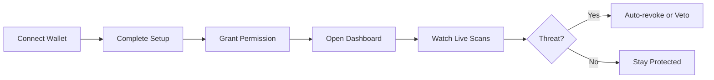
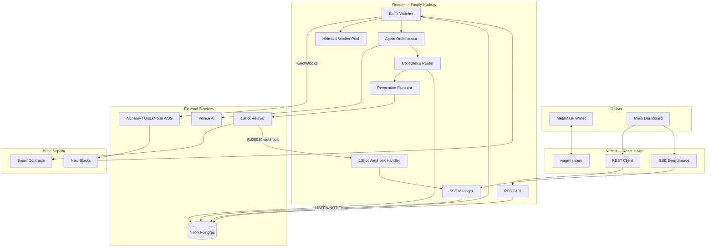
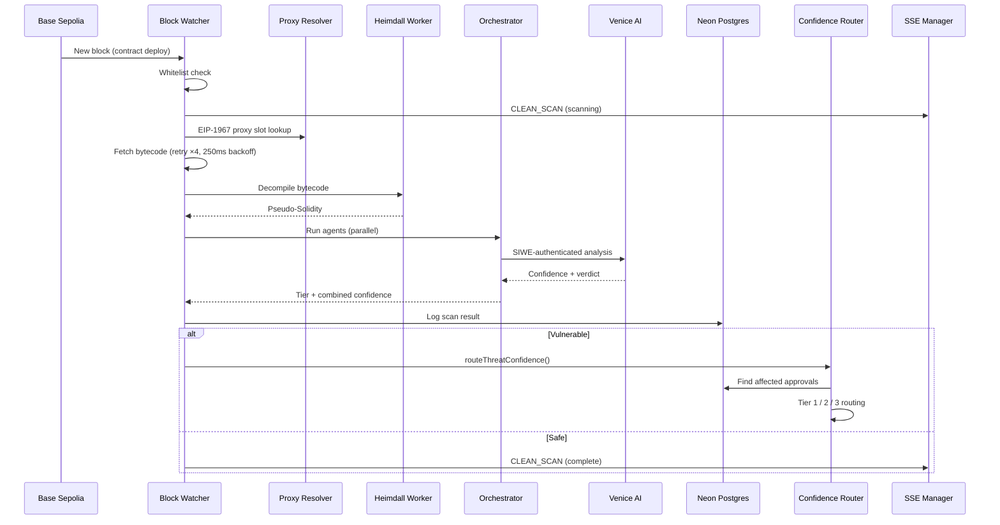
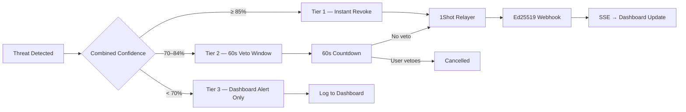
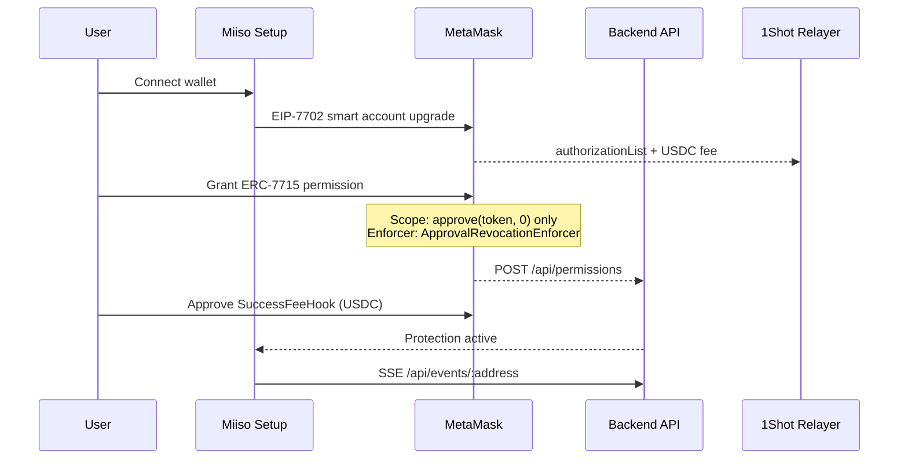
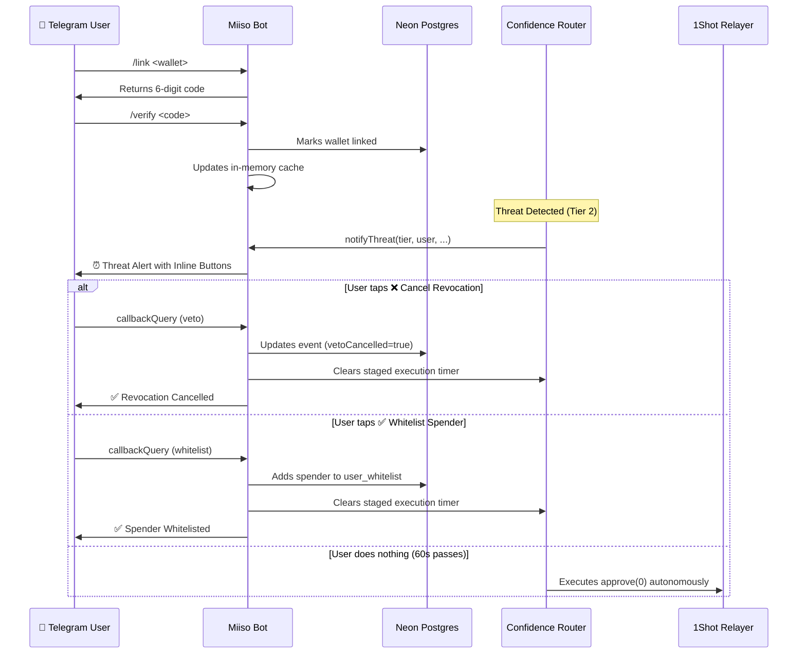

<p align="center">
  
</p>

<h1 align="center">Miiso</h1>

<p align="center">
  <strong>Autonomous on-chain DeFi security — detect threats in seconds, revoke approvals before attackers act.</strong>
</p>

<p align="center">
  <a href="https://miiso-ai.vercel.app/"></a>
  <a href="https://miiso.onrender.com/api/health"></a>
  
</p>

<p align="center">
  <a href="https://miiso-ai.vercel.app/">Frontend</a> ·
  <a href="https://miiso.onrender.com/api/health">Backend</a> ·
  <a href="#architecture">Architecture</a> ·
  <a href="#features">Features</a> ·
  <a href="#try-it-live">Try It Live</a> ·
  <a href="#getting-started">Getting Started</a>
</p>

---

## Overview

**Miiso** is a 24/7 autonomous security agent for DeFi wallets on **Base Sepolia**. It watches every new contract deployment in real time, decompiles bytecode, runs AI-powered threat analysis, and — when confidence is high enough — automatically revokes dangerous token approvals on your behalf.

You grant Miiso a single scoped permission: **reset a token approval to zero**. Nothing else. No transfers. No swaps. Enforced on-chain via MetaMask Smart Accounts and ERC-7710 caveats.

```
Deploy → Detect → Decompile → Analyze → Route → Revoke → Confirm
         └────────────── under 10 seconds end-to-end ──────────────┘
```

| | |
|---|---|
| **Problem** | $1.49B lost to DeFi exploits in 2024. Most attacks exploit forgotten unlimited approvals — not broken cryptography. |
| **Solution** | Miiso monitors Base blocks, flags malicious contracts with Venice AI, and fires `approve(spender, 0)` via the 1Shot relayer — paid in USDC, no ETH required. |
| **User cost** | ~$0.01 USDC per relay + 1.5% success fee on protected value |

---

## Live

| Service | URL |
|---------|-----|
| **Frontend** | [miiso-ai.vercel.app](https://miiso-ai.vercel.app/) |
| **Backend API** | [miiso.onrender.com](https://miiso.onrender.com) |
| **Health check** | [GET /api/health](https://miiso.onrender.com/api/health) |

---

## Features

<table>
<tr>
<td width="50%" valign="top">

### Real-time block surveillance
Watches every new contract deployment on Base Sepolia via WebSocket RPC. Proxy contracts resolved through EIP-1967 before analysis begins.

### AI threat intelligence
Bytecode is decompiled with Heimdall-rs, then analyzed by Venice AI's uncensored model. Raw bytecode is never sent to the model — decompilation always comes first.

### Three-tier confidence routing
High-confidence threats revoke instantly. Medium threats get a 60-second veto window. Low-confidence findings are logged — you stay in control.

</td>
<td width="50%" valign="top">

### Least-privilege permissions
One scoped ERC-7715 delegation: `approve(spender, 0)` only. The `ApprovalRevocationEnforcer` rejects every other action on-chain.

### Zero ETH gas
All relay transactions settle through 1Shot in USDC. No ETH balance required to stay protected.

### Live dashboard + SSE
PostgreSQL LISTEN/NOTIFY pushes events to your browser in under 4 seconds. Veto timers, scan feed, and tx confirmations update in real time.

</td>
</tr>
</table>

### What Miiso can — and cannot — do

| | Allowed | Blocked |
|---|:---:|:---:|
| Revoke token approvals (`approve(0)`) | ✅ | |
| Transfer your tokens | | ❌ |
| Swap or bridge assets | | ❌ |
| Approve new spenders | | ❌ |
| Exceed your USDC budget cap | | ❌ |
| Act on whitelisted protocols | | ❌ |

---

## Try it live

No install required — the full product is running on Base Sepolia.



| Step | Action | What happens |
|------|--------|--------------|
| **1** | Visit [miiso-ai.vercel.app](https://miiso-ai.vercel.app/) | Landing page loads |
| **2** | Connect MetaMask on **Base Sepolia** | Wallet linked, SSE stream opens |
| **3** | Run the **Setup wizard** (~2 min) | EIP-7702 upgrade → ERC-7715 permission → fee hook approval |
| **4** | Open **Dashboard** | Live network scans, approval cache, protection history |
| **5** | Wait for a threat — or use **Research** | Analyze any contract on demand |

> **Demo tip:** Deploy the honeypot test contract (`pnpm deploy:honeypot`) and watch the pipeline detect, analyze, and route the threat in under 10 seconds.

---

## Performance

End-to-end pipeline benchmarks on Base Sepolia testnet:

| Stage | Typical latency |
|-------|----------------|
| Block detection | ~180ms after inclusion |
| Bytecode fetch + proxy resolve | ~250ms–1s (with retry backoff) |
| Heimdall decompilation | ~2–8s (worker pool, 30s hard timeout) |
| Venice AI analysis | ~3–5s (SIWE x402 auth) |
| 1Shot relay submission | ~1–2s |
| Webhook → dashboard update | < 4s via SSE |
| **Full pipeline** | **< 10s** deploy → revoke |

| Metric | Value |
|--------|-------|
| Chain | Base Sepolia (84532) |
| Confidence model | Venice AI + static bytecode analysis |
| Tier 1 threshold | ≥ 85% — instant revoke |
| Tier 2 threshold | 70–84% — 60s veto window |
| Relay cost | ~$0.01 USDC per transaction |
| Success fee | 1.5% of protected value |

---

## Architecture

### System overview



### Threat detection pipeline

Every contract creation transaction (`tx.to === null`) enters the pipeline within milliseconds of block inclusion.



### Confidence routing

Miiso never acts blindly. Every threat is scored and routed through three tiers based on combined confidence (Venice AI + static analysis).



| Tier | Threshold | Action | User control |
|------|-----------|--------|--------------|
| **Tier 1** | ≥ 85% | Immediate `approve(0)` via 1Shot | None — autonomous |
| **Tier 2** | 70–84% | 60-second veto countdown, then revoke | Cancel within window |
| **Tier 3** | < 70% | Informational alert only | Manual revoke from dashboard |

Security profiles (`safe` · `balanced` · `manual`) adjust tier behavior per user.

### Permission & setup flow



### Telegram Integration

Miiso brings autonomous security directly to your phone via a dedicated Telegram bot. The bot offers real-time threat alerts and interactive inline actions without needing to open the web dashboard.



---

## Tech stack

### Frontend
| | |
|---|---|
| Framework | React 19 + TypeScript + Vite |
| Styling | Tailwind CSS 4 + Framer Motion |
| Wallet | wagmi 2 + viem + MetaMask Smart Accounts Kit |
| State | Zustand + TanStack Query |
| Hosting | [Vercel](https://vercel.com) |

### Backend
| | |
|---|---|
| Runtime | Node.js + Fastify |
| Blockchain | viem (WSS block watcher, Base Sepolia) |
| AI | Venice AI (SIWE x402 auth) |
| Decompiler | Heimdall-rs (worker thread pool, 30s timeout) |
| Relay | 1Shot API (USDC gas, EIP-7702) |
| Database | Neon Postgres + Drizzle ORM + pgvector |
| Real-time | PostgreSQL LISTEN/NOTIFY → SSE |
| Hosting | [Render](https://render.com) |

### Smart contracts (Base Sepolia)
| Contract | Purpose |
|----------|---------|
| `ApprovalRevocationEnforcer` | On-chain caveat — only `approve(spender, 0)` allowed |
| `MiisoSuccessFeeHook` | Pulls 1.5% success fee in USDC after protection |
| `HoneypotDrainer` | Test contract for end-to-end pipeline demos |

---

## Project structure

```
Miiso/
├── frontend/               # React SPA (Vercel)
│   ├── src/
│   │   ├── lib/            # API client, MetaMask integration
│   │   ├── hooks/          # SSE, dashboard, permissions
│   │   ├── components/     # Dashboard panels, veto timer
│   │   └── store/          # Zustand global state
│   └── public/
│       └── miiso-fevicon.png
│
├── backend/                # Fastify sentinel (Render)
│   ├── src/
│   │   ├── daemon/         # Block watcher, Venice, confidence router
│   │   ├── agents/         # Research, data, analysis, executor agents
│   │   ├── server/         # REST routes + SSE manager
│   │   ├── blockchain/     # viem clients, 1Shot relay, approval scanner
│   │   ├── db/             # Drizzle schema + queries
│   │   └── security/       # Ed25519 webhook verify, whitelist
│   └── workers/            # Heimdall decompiler worker threads
│
└── contracts/              # Hardhat — Solidity enforcers + honeypot
    ├── src/
    └── scripts/
```

---

## Getting started

### Prerequisites

- **Node.js** 20+
- **pnpm** 9+
- **MetaMask** with Base Sepolia network
- **Neon** Postgres database
- API keys: Alchemy (WSS), Venice AI, 1Shot relayer

### Install

```bash
git clone https://github.com/SATISH-JALAN/Miiso.git
cd Miiso
pnpm install
```

### Database setup

```bash
cd backend
node scripts/enable-pgvector.js
npx drizzle-kit push
```

Copy `backend/.env.example` and `frontend/.env.example` to configure local credentials before starting.

### Run locally

```bash
# Terminal 1 — backend (port 3001)
pnpm dev:backend

# Terminal 2 — frontend (port 3000)
pnpm dev:frontend
```

Open [http://localhost:3000](http://localhost:3000), connect MetaMask on **Base Sepolia**, and complete the setup wizard.

### Verify pipeline

```bash
pnpm sprint1:verify          # static checklist
pnpm sprint1:e2e             # end-to-end (backend must be running)
pnpm deploy:honeypot         # deploy test drainer to Base Sepolia
```

---

## API reference

| Method | Endpoint | Description |
|--------|----------|-------------|
| `GET` | `/api/health` | Service health + chain ID |
| `POST` | `/api/permissions` | Register ERC-7715 permission |
| `GET` | `/api/permissions/:address` | Get permission status |
| `DELETE` | `/api/permissions/:address` | Revoke delegation |
| `GET` | `/api/dashboard/:address` | Protection stats |
| `GET` | `/api/approvals/:address` | Cached token approvals |
| `GET` | `/api/history/:address` | Protection event history |
| `GET` | `/api/events/:address` | SSE live event stream |
| `POST` | `/api/veto/:eventId` | Cancel Tier 2 revocation |
| `POST` | `/api/analyze` | On-demand contract analysis |
| `POST` | `/api/webhooks/1shot` | 1Shot relay confirmation (Ed25519) |
| `GET` | `/api/relay/capabilities` | 1Shot fee + relayer info |

---

## Security

- **Least privilege** — Agent can only call `approve(spender, 0)`. Enforced by `ApprovalRevocationEnforcer` on-chain.
- **Webhook verification** — 1Shot callbacks verified via native Node.js `crypto.verify` (Ed25519). No third-party crypto libs.
- **SIWE auth** — Venice AI requests authenticated with EIP-191 signed SIWE messages. Single-use nonces.
- **No key exposure** — Agent private key lives in server env only. Never logged or sent to clients.
- **Whitelist layers** — Global protocol whitelist + per-user spender whitelist before any revocation.
- **Rate limiting** — 100 requests/minute per IP on all API routes.

---

## Built with

<p align="center">
  
  
  
  
  
</p>

> Built for: **MetaMask Smart Accounts Kit** × **1Shot API** × **Venice AI** on **Base**

---

<p align="center">
  
  <br />
  <sub>Fermented protection for your digital assets.</sub>
</p>
